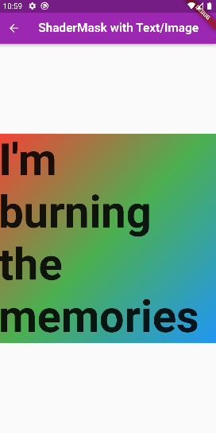
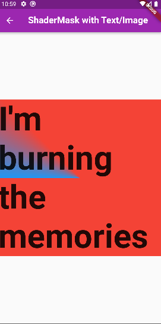
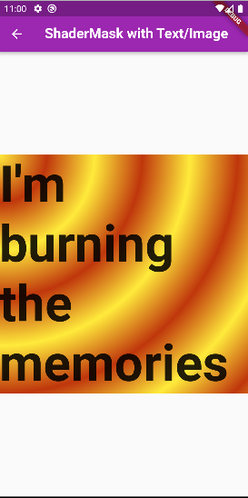

## 1. Research: Flutter Shader Mask Widget

- Keywords:
    - shadermask in flutter
    - shadermask flutter
    - shadermask flutter example
    - flutter shadermask image
    - flutter shadermask animation
    - flutter blendmode
    - flutter custom shader
    - flutter mask container
    - flutter mask widget
    - flutter linear gradient
    - flutter linear gradient generator
    - flutter linear gradient top to bottom
    - flutter gradient
    - flutter animation
    - flutter mask image
    - flutter blendmode example
    - flutter boxdecoration background blend mode
    - flutter container blendmode
- Video Title: ShaderMask in Flutter - ShaderMask Widget Animation with Image, Shimmer Loading Effect in Flutter


## 2. Research: Competitors

**Flutter Videos/Articles**

- 119K: https://www.youtube.com/watch?v=7sUL66pTQ7Q
- 5K: https://www.youtube.com/watch?v=JD5IDUD-Moo
- 8.3K: https://www.youtube.com/watch?v=NaVyyUOp3SQ
- 10K: https://www.youtube.com/watch?v=fv973pFqnD4
- 85K: https://www.youtube.com/watch?v=-SpAkwgPIHU
- https://api.flutter.dev/flutter/widgets/ShaderMask-class.html
- https://www.woolha.com/tutorials/flutter-using-shadermask-widget-examples#:~:text=Flutter%20has%20a%20widget%20called,need%20to%20provide%20a%20ShaderCallback%20.
- https://medium.flutterdevs.com/shadermask-in-flutter-706d9948eb90
- https://medium.com/flutter-community/an-overview-on-shadermask-89201539ba8d
- https://pub.dev/documentation/flutter_for_web/latest/widgets/ShaderMask-class.html
- https://instructivetech.com/flutter-shadermask-text-gradient/

**Android/Swift/React Videos**

- 7.8K: https://www.youtube.com/watch?v=gO3HeYcQCqw
- 41K: https://www.youtube.com/watch?v=RRuQZSbueJE
- 7.2K: https://www.youtube.com/watch?v=70gKWkz5nXs
- 4.2K: https://www.youtube.com/watch?v=mjhPEBOcmpw
- 3.4K: https://www.youtube.com/watch?v=Ldeer7bwwUs
- 1.4k: https://www.youtube.com/watch?v=-_am5AqBBgc
- 8K: https://www.youtube.com/watch?v=lNgvyUIUfuc
- 6.5K: https://www.youtube.com/watch?v=Gz91A7Gii-8
- 1.1K: https://www.youtube.com/watch?v=lVlg8lW38C4
- 3.2K: https://www.youtube.com/watch?v=9Qyli7Z9R_c
- https://medium.com/swlh/how-to-create-advanced-shadows-in-swift-ios-swift-guide-9d2844b653f8
- https://programmingwithswift.com/add-a-shadow-to-a-uiview-with-swift/
- https://www.cyanhall.com/how-to/iOS/2.add-drop-shadow-effect-to-uiview
- https://www.swiftpublisher.com/support/help/editing-documents-applying-the-shadow-effect
- https://www.tutorialkart.com/kotlin-android/kotlin-android-textview-shadow-effect/

**Great Features**
- ShaderMask widget applies a mask generated by a Shader to its child. It can be used to apply effects such as gradients or images.
- It works similar to shimmer loading effect in Android (Kotlin) and iOS (Swift).

**Problems from Videos**
- Question: How to set image as shader using this widget? <br />
Answer: Just replace the child of ShaderMask with Image widget.
- Question: Is shimmer the shadow outline that appears while loading? <br />
Answer: Yes
- Question: Widget isn't shimmering while loading? <br />
Answer: Actually it shows for few seconds, and even on YouTube they are not animated shimmer effect!

**Problems from Flutter Stackoverflow**

- https://stackoverflow.com/questions/62521636/flutter-shadermask-using-an-imageshader
- https://stackoverflow.com/questions/61396798/apply-borderradius-to-widget-with-shadermask
- https://stackoverflow.com/questions/70429391/shadermask-not-applying-to-full-child
- https://stackoverflow.com/questions/59705860/shadermask-lineargradients-stops-strange-behavior
- https://stackoverflow.com/questions/67748387/why-is-shader-mask-not-working-on-flutter-web
- https://stackoverflow.com/questions/61210453/overlay-a-gradient-shader-mask-on-part-of-the-image
- https://stackoverflow.com/questions/72772642/text-gradient-color-shadow-not-display-properly-in-flutter

## 3. Video Structure

**Main Points / Purpose Of Lesson**

1. A widget that applies a mask generated by a Shader to its child. For example, ShaderMask can be used to gradually fade out the edge of a child by using a ui.Gradient.linear mask. It can also show shimmer loading effect.
2. Main Points
    - ShaderMask widget can shade in LinearGradient, SweepGradient, and RadialGradient.
    - ShaderMask can shade text/image with colors. It can also make shimmer loading effect.
3. It is the best widget/class to shade text or image with beautiful animations and list of colors.

**The Structured Main Content**
1. Make a clean new project in flutter and inside a single screen add `text` in the `body` of `Scaffold`. Wrap that `text` widget with `ShaderMask` widget.
2. For this video:
    - No need of setup for Android & iOS
    - ShaderMask with `shaderCallback` type `LinearGradient`. `begin` and `end` properties declare the list of colors with beginning and end arrangement. `begin` is the offset at which stop 0.0 of the gradient is placed. `end` is the offset at which stop 1.0 of the gradient is placed.
    ```dart 
        body: Center(
          child: ShaderMask(
            blendMode: BlendMode.color,
            shaderCallback: (bounds) => const LinearGradient(
              begin: Alignment.topLeft,
              end: Alignment.bottomRight,
              colors: [
                Colors.red,
                Colors.green,
                Colors.blue,
              ],
            ).createShader(bounds),

            child: const Text('I\'m burning the memories'),
          ),
        ),
      );
    ```
    Output: <br />
    
    - ShaderMask with `shaderCallback` type `SweepGradient` using `pi` constant of `dart:math` library. `startAngle` is the angle in radians at which stop 0.0 of the gradient is placed. It defaults to 0.0. `endAngle` is the angle in radians at which stop 1.0 of the gradient is placed. It defaults to `math.pi * 2`. `transform` is GradientTransform that creates a sweep gradient.
    ```dart 
        body: Center(
          child: ShaderMask(
            blendMode: BlendMode.color,
            shaderCallback: (bounds) => const SweepGradient(
              startAngle: 0,
              endAngle: math.pi / 4,
              colors: [
                Colors.blue,
                Colors.red,
              ],
              transform: GradientRotation(math.pi),
            ).createShader(bounds),

            child: const Text('I\'m burning the memories'),
          ),
        ),
      );
    ```
    Output: <br />
    
    - ShaderMask with `shaderCallback` type `RadialGradient`. `center` is the center of the gradient, as an offset into the (-1.0, -1.0) x (1.0, 1.0) square describing the gradient which will be mapped onto the paint box. For this case `center: Alignment.topLeft,`, alignment starts from topLeft side of box. `tileMode` is how this gradient should tile the plane beyond the outer ring at radius pixels from the center.
    ```dart 
        body: Center(
          child: ShaderMask(
            blendMode: BlendMode.color,
            shaderCallback: (bounds) => RadialGradient(
              center: Alignment.topLeft,
              radius: 0.2,
              colors: [
                Colors.yellow,
                Colors.deepOrange.shade900,
              ],
              tileMode: TileMode.mirror,
            ).createShader(bounds),

            child: const Text('I\'m burning the memories'),
          ),
        ),
      );
    ```
    Output: <br />
    
